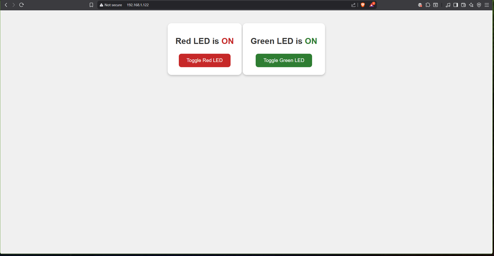
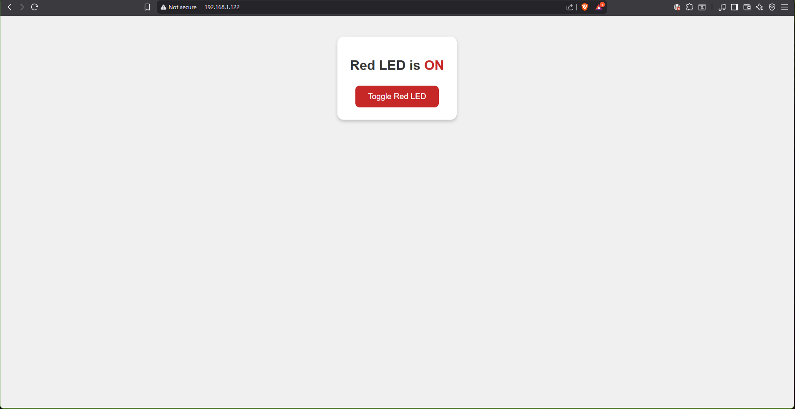

# infoTRON
**ESP32 and Arduino lab exercises for the infoTRON 2026 mechatronics program**

[](LICENSE)


## Table of Contents

- [Description](#description)
- [Requirements](#requirements)
- [Installation](#installation)
- [Usage](#usage)
- [Screenshots](#screenshots)
- [License](#license)

## Description

infoTRON collects open, classroom-ready lab exercises for the **infoTRON 2026 mechatronics program**. The labs are organized into two tracks — `LED/` for bare-metal GPIO work and `Web/` for networked control — so students get quick, visible results on an ESP32 board and then iterate on pinouts, timings, and interfaces. Every exercise is a self-contained Arduino `.ino` sketch with commented code that walks through the setup.

### Features

- **LED labs:** timed LED blink, a traffic-light semaphore with fixed red/yellow/green phases, button-cycled lighting patterns across three LEDs, and RGB color sequencing (LEDs on pins 25–27, push button on pin 34).
- **Web labs:** ESP32 asynchronous web server serving static HTML, CSS, and JavaScript from flash (LittleFS), with JSON REST endpoints such as `/api/toggleRedLED` and `/api/getRedLEDState` that toggle LEDs and report their state back to the browser.
- **Web starter template:** a minimal server sketch (`Web/template/`) for scaffolding new exercises.
- **Reference screenshots** shipped with the web labs for the expected UI and API responses.

## Requirements

- ESP32 development board
- Breadboard, jumper wires, LEDs, resistors (plus a push button for the LED pattern lab)
- Arduino IDE with the **ESP32 board package**
- Optional: [ESPAsyncWebServer](https://github.com/me-no-dev/ESPAsyncWebServer) and LittleFS plugin for web demos

## Installation

```bash
git clone https://github.com/DarkSoulEngineer/infoTRON.git
cd infoTRON
```

1. In Arduino IDE, install the ESP32 board package via `Sketch > Include Library > Manage Libraries` / Boards Manager.
2. For the web labs, install [ESPAsyncWebServer](https://github.com/me-no-dev/ESPAsyncWebServer) (ZIP library or Library Manager) and the LittleFS data-upload plugin.
3. Open any sketch from `LED/` or `Web/` in the Arduino IDE.

## Usage

1. Pick a lab folder (`LED/` or `Web/`).
2. Open the corresponding `.ino` sketch in Arduino IDE.
3. Select the correct ESP32 board and COM port, then upload the sketch.
4. For LED labs: wire the LEDs (and button) to the pins declared at the top of the sketch and watch the sequence run.
5. For web labs: replace the `yourSSID` / `yourPASSWORD` placeholders with your Wi-Fi credentials, upload the lab's `data/` folder to flash, then open the Serial Monitor to read the board's IP address and browse to it in a browser to interact with the UI.

> Feel free to adapt pinouts, timings, or UI text to match your classroom kit.

## Screenshots





## License

MIT — see [LICENSE](LICENSE).
